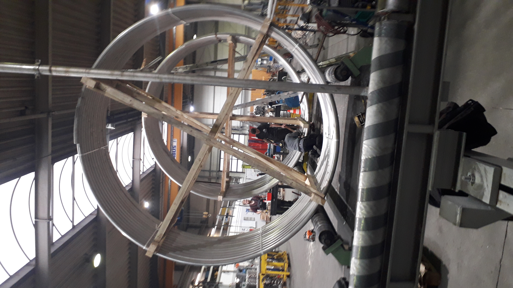

  

 Rollmaschine calculator </h1>
  
---

diese Anwendung wurde entwickelt, um die Parameter bei der Herstellung von zylindrischen Rohrschlangen zu berechnen

die Anwendung kann unter Windows ausgeführt werden.es gibt auch eine mobile Version von Android (Datei android-build-debug.apk)
## beschreibung des Codes
- die Anwendung erstellt ein Widget-Formular in Qt Designer und ist mithilfe der Mehrfachvererbung in den Code integriert :

   class CallerCalculator : public QWidget, public Ui::Rollmaschine_calculator {
    }

  - String СallerCalculator::Calculate_durchmesser();
  
     berechnet den Innendurchmesser Rohrsсhlange

  - String CallerCalculator::Calculate_schablone()
    
    berechnet den Radius des Musters eines gegebenen Durchmessers

  - wenn Sie die Calc-Taste drücken, wird der Calculate() slot aufgerufen und das Ergebnis wird angezeigt
